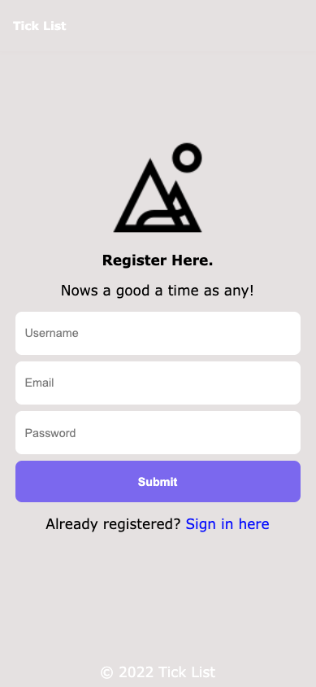
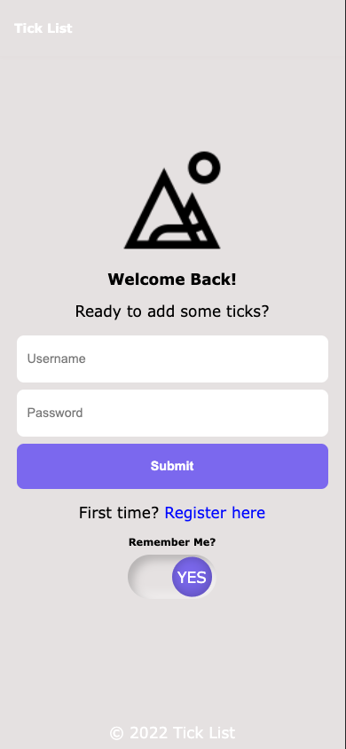
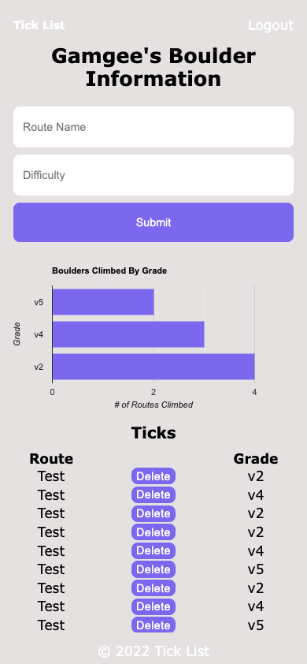

[![GitHub][github-shield]][github-url]
[![LinkedIn][linkedin-shield]][linkedin-url]
[![MIT License][license-shield]][license-url]
[![JavaScript][javascript-shield]][javascript-url] 
[![Contributors][contributors-shield]][contributors-url]
[![Stargazers][stars-shield]][stars-url]
[![Issues][issues-shield]][issues-url]

    
<h1 >Tick List</h1>

    Welcome to <strong>Tick List</strong>! Tick List is a full stack mobile application that allows the user to keep record of thier Tick's. A Tick is rock climbing slang for when a climber completes a route from start to finish. When a climber 
    achieves this, it's common practice to add that route to your <strong>Tick List</strong>.

    

    
<h2>Table of Contents</h2>

    <ol>
        <li>
            <a href="#getting-started">Getting Started</a>
            <ul>
                <li><a href='#about'>About The Project</a></li>
                <li><a href='#dependencies'>Dependencies</a></li>
                <li><a href="#installation">Installation</a></li>
            </ul>
        </li>
        <li><a href="#roadmap"> Roadmap </a></li>
        <li><a href="#screenshots">Screenshots</a></li>
        <li><a href="#contributing"> Contributing </a></li>
        <li><a href="#license"> License </a></li>
        <li><a href="#deployment"> Deployment </a></li>
        <li><a href="#contact"> Contact </a></li>
    </ol>

 

<h1 id='getting-started' align='center'> Getting Started </h1>

<h2 id='about'> About The Project </h2>

 
    I've found myself using other <strong>"Tick List"</strong> style applications that only allow you to use routes available from their database. However, as an adventrous climber, many of the routes I've persued have been off the beaten path. This leads to the data pertaining to my climbing performance skewed. So I chose to build an application, albeit less convenient, that gives the user control over their performance data. 

 ⛰️&emsp; ⛰️&emsp; ⛰️&emsp;  

<h2 id='dependencies'> Dependencies </h2>

<table align='left'>
    <tr>
        <th colspan="1"> Client </th>
        <th rowspan="8">  </th>
    </tr>
    <tr> 
        <td> <a href='https://www.npmjs.com/package/react'> React </a> </td> 
    </tr>
    <tr> 
        <td> <a href='https://www.npmjs.com/package/@apollo/client'> ApolloClient </a> </td>
    </tr>
    <tr> 
        <td> <a href='https://www.npmjs.com/package/graphql'> GraphQL </a> </td> 
    </tr>
    <tr> 
        <td> <a href='https://www.npmjs.com/package/jwt-decode'> JWT-Decode </a> </td> 
    </tr>
    <tr> 
        <td> <a href='https://www.npmjs.com/package/react-dom'> React-Dom </a> </td>
    </tr>
    <tr> 
        <td> <a href='https://www.npmjs.com/package/react-scripts'> React-Scripts </a> </td>
    </tr>
    <tr>  
        <td> <a href='https://www.npmjs.com/package/react-google-charts'> React-Google-Charts </a> </td>
    </tr>    
</table>

<table>
    <tr>
        <th colspan="1"> Server </th>
    </tr> 
    <tr> 
        <td> <a href='https://www.npmjs.com/package/apollo-server-express'> Apollo-Server-Express </a> </td> </tr>
    <tr> 
        <td> <a href='https://www.npmjs.com/package/express'> Express </a> </td> 
    </tr>
    <tr> 
        <td> <a href='https://www.npmjs.com/package/graphql'> GraphQL </a> </td> 
    </tr>
    <tr> 
        <td> <a href='https://www.npmjs.com/package/mongoose'> Mongoose </td> 
    </tr>
    <tr> 
        <td> <a href='https://www.npmjs.com/package/bcrypt'> Bcrypt </a> </td> 
    </tr>
    <tr> 
        <td> <a href='https://www.npmjs.com/package/dotenv'> DotEnv </a> </td> 
    </tr>
    <tr> 
        <td> <a href='https://www.npmjs.com/package/jsonwebtoken'> Json Web Token </a> </td> 
    </tr>
</table>

 ⛰️&emsp; ⛰️&emsp; ⛰️&emsp;  

<h2 id='installation'> Installation </h2>

- From the browser 
    - Navigate to the <a href='https://www.github.com/gamgee-em/Tick-List'> Tick List </a> repository
- From the command line or terminal
    - Clone the repository
    - From the root folder run the command 'npm i' or 'npm install'
- To run the application
    - Run the command 'npm run dev'

 ⛰️&emsp; ⛰️&emsp; ⛰️&emsp;  

<h2 id='Roadmap'> Roadmap </h2>

- Mobile MVP (Minimum Viable Product) ✔️
- Desktop MVP 🔜 
- Delete Ticks 🔜 
- Scale Ticks to accept not only boulders but routes as well 🔜 
- Climber Field Guide Section 🔜

 ⛰️&emsp; ⛰️&emsp; ⛰️&emsp;  

<h2 id='screenshots'> ScreenShots </h2>

 ⛰️&emsp; ⛰️&emsp; ⛰️&emsp;  

<h2 id='contributing'> Contributing </h2>

1. Fork the repo on GitHub
2. Clone the project to your own machine
3. Commit changes to your own branch
4. Push your work back up to your fork
5. Submit a Pull request of your changes for review

 ⛰️&emsp; ⛰️&emsp; ⛰️&emsp;  

<h2> Queries </h2>

    query getAllUsers {
        getAllUsers {
            _id
            token
            username
            email
            ticks {
                route_name
                difficulty
            }
        }
    }

    query getSingleUser($_id: ID!) {
        getSingleUser(_id: $_id) {
            _id
            token
            username
            email
            ticks {
                route_name
                difficulty
            }
        }
    }

    query me {
        me {
            _id
            username
            email
            ticks {
                _id
                route_name
                difficulty
            }
        }
    }

 ⛰️&emsp; ⛰️&emsp; ⛰️&emsp;  

<h2> Mutations </h2>

    mutation addUser($username: String!, $email: String!, $password: String!) {
        addUser(username: $username, email: $email, password: $password) {
            token
            user {
                _id
                username
            }
        }
    }

    mutation signInUser($username: String!, $password: String!) {
        signInUser(username: $username, password: $password) {
            token
            user {
                _id
                username
            }
        }
    }

    mutation addTick($route_name: String!, $difficulty: String!) {
        addTick(route_name: $route_name, difficulty: $difficulty) {
            _id
            ticks {
                route_name
                difficulty
            }
        }
    }

    mutation deleteTick($_id: ID!) {
        deleteTick(_id: $_id) {
            _id
            username
            email
            ticks {
                _id
                route_name
                difficulty
            }
        }
    }

    mutation updateTick($_id: ID!) {
        updateTick(_id: $_id, route_name: $route_name, difficulty: $diffculty) {
            _id
            username
            email
            ticks {
                _id
                route_name
                difficulty
            }
        }
    }

 ⛰️&emsp; ⛰️&emsp; ⛰️&emsp;  

<h2 id='license'> License </h2>

 Distributed under the MIT License. See <a href='https://github.com/gamgee-em/Tick-List/blob/main/LICENSE.txt'> LICENSE.txt </a> for additional information. 

 ⛰️&emsp; ⛰️&emsp; ⛰️&emsp;  

<h2 id='deployment'> Deployment </h2>

 Live Site: <a href='https://ge-tick-list.herokuapp.com/'> Tick List </a>

 ⛰️&emsp; ⛰️&emsp; ⛰️&emsp;  

<h2 id='contact'> Contact </h2>

 Email: <a href='mailto: samuel.sweigart@gmail.com'> samuel.sweigart@gmail.com </a> 

 Repository: <a href='https://www.github.com/gamgee-em/Tick-List'> Tick List </a> 

 ⛰️&emsp; ⛰️&emsp; ⛰️&emsp;  

 
    (<a href="#top"> Back to Top</a>) 

[github-shield]: https://img.shields.io/badge/Gamgee--Em-%23121011.svg?style=for-the-badge&logo=github&logoColor=black&colorB=bf7e32
[github-url]: https://github.com/gamgee-em

[javascript-shield]: https://img.shields.io/badge/javascript-Es6-black?style=for-the-badge&logo=javascript&logoColor=pink
[javascript-url]: https://www.w3schools.com/js/js_es6.asp

[contributors-shield]: https://img.shields.io/github/contributors/gamgee-em/Tick-List.svg?style=for-the-badge&color=yellow
[contributors-url]: https://github.com/gamgee-em/tick-list/graphs/contributors

[stars-shield]: https://img.shields.io/github/stars/gamgee-em/Tick-List.svg?style=for-the-badge&color=ec9198&labelColor=black
[stars-url]: https://github.com/gamgee-em/Tick-List/stargazers

[issues-shield]: https://img.shields.io/github/issues/gamgee-em/Tick-List.svg?style=for-the-badge&color=5431a2
[issues-url]: https://github.com/gamgee-em/Tick-List/issues

[license-shield]: https://img.shields.io/github/license/gamgee-em/Tick-List.svg?style=for-the-badge&color=ad7dbd
[license-url]: https://github.com/gamgee-em/Tick-List/blob/main/LICENSE.txt

[linkedin-shield]: https://img.shields.io/badge/-LinkedIn-black.svg?style=for-the-badge&logo=linkedin&logoColor=black&colorB=blue
[linkedin-url]: https://linkedin.com/in/gamgee-em
